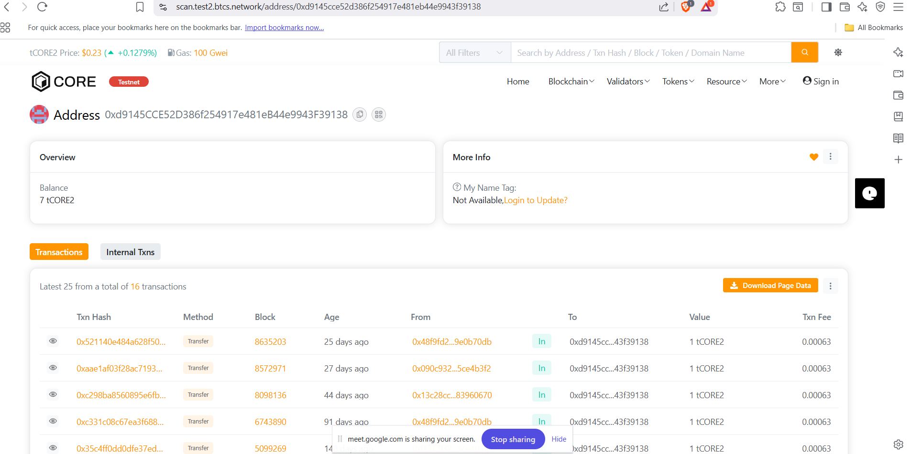

# ChainVertex

## Project Title
**ChainVertex** - Decentralized Data Vertex Management System

## Project Description

ChainVertex is a blockchain-based smart contract project designed to enable decentralized management of interconnected data vertices. Built with Solidity, it provides a secure, transparent, and efficient infrastructure for creating and managing complex data relationships on the blockchain. The system leverages the power of smart contracts to ensure immutability, trustlessness, and decentralized governance across a distributed network.

ChainVertex allows users to create vertices (data nodes), establish edges (connections) between them with weighted relationships, and query the resulting graph structure entirely on-chain. This eliminates the need for centralized databases and provides cryptographic proof of all operations.

## Project Vision

Our vision is to democratize decentralized data management by creating an open, accessible infrastructure where complex data relationships can be managed transparently without intermediaries. We envision ChainVertex becoming the backbone for Web3 applications that require sophisticated graph-based data structures with guaranteed immutability and decentralized control.

By combining the security of blockchain technology with efficient graph data structures, ChainVertex aspires to enable a new generation of decentralized applications that were previously impossible to build on-chain.

## Key Features

### 1. Vertex Creation & Management
- Create new data vertices with unique identifiers and customizable metadata
- Store and retrieve vertex information securely on-chain
- Track vertex ownership, creation timestamps, and lifecycle status
- Support for large-scale vertex networks with efficient indexing
- Vertex deletion with ownership verification

### 2. Edge Connection System
- Establish weighted connections between vertices representing various relationship types
- Create complex graph structures with support for multi-directional edges
- Assign custom relationship types and weights to connections
- Prevent circular dependencies with self-loop validation
- Efficient edge traversal and neighbor discovery

### 3. Graph Query & Data Retrieval
- Query individual vertex information with real-time data access
- Retrieve all adjacent vertices and connected relationships
- Access complete edge details including weight and relationship type
- Get user-specific vertex collections for personalized queries
- Retrieve comprehensive graph statistics (vertex count, edge count)

### 4. Security & Access Control
- Owner-based access control for sensitive operations
- Modular permission system for future enhancement
- Immutable transaction records with event logging
- Data validation and constraint enforcement
- Protection against common smart contract vulnerabilities

### 5. Event Logging & Transparency
- Comprehensive event emissions for all contract state changes
- Real-time notification of vertex and edge creation/deletion
- Complete audit trail for compliance and verification
- Integration-ready for off-chain event indexing and analysis

## Future Scope

### Phase 1: Core Enhancement (Q1 2024)
- Gas optimization for large-scale operations
- Batch vertex and edge creation functions
- Advanced filtering and search capabilities
- Integration with popular blockchain data indexers

### Phase 2: Advanced Features (Q2 2024)
- Multi-chain compatibility (Ethereum, Polygon, Arbitrum)
- IPFS integration for large metadata storage
- Governance token implementation
- Community-driven protocol updates via DAO

### Phase 3: Enterprise Solutions (Q3 2024)
- Role-based access control (RBAC) system
- Fine-grained permission management
- Audit logging and compliance tools
- Enterprise API and SDK development

### Phase 4: Scalability & Performance (Q4 2024)
- Layer 2 integration (Arbitrum, Optimism)
- Sharding mechanisms for distributed processing
- Zero-knowledge proof privacy features
- Cross-chain vertex synchronization

### Phase 5: Ecosystem & Adoption (2025+)
- DApp marketplace for vertex applications
- Mobile application development
- AI-powered relationship discovery
- Enterprise integration services
- Academic partnerships and research initiatives

## Getting Started

### Prerequisites
- Node.js (v16 or higher)
- npm or yarn package manager
- Hardhat development environment

### Installation

1. Clone the repository:
```bash
git clone https://github.com/yourusername/ChainVertex.git
cd ChainVertex
```

2. Install dependencies:
```bash
npm install
```

3. Configure your environment:
```bash
cp .env.example .env
# Edit .env with your configuration
```

4. Compile the smart contract:
```bash
npx hardhat compile
```

5. Run tests:
```bash
npx hardhat test
```

6. Deploy to testnet:
```bash
npx hardhat run scripts/deploy.js --network testnet
```

## Smart Contract Functions

### Core Functions

1. **createVertex(string memory _data) → uint256**
   - Creates a new vertex in the graph
   - Returns the ID of the newly created vertex
   - Emits VertexCreated event

2. **createEdge(uint256 _fromVertex, uint256 _toVertex, uint256 _weight, string memory _edgeType)**
   - Establishes a connection between two vertices
   - Validates vertex existence and prevents self-loops
   - Emits EdgeCreated event

3. **getVertex(uint256 _vertexId) → Vertex**
   - Retrieves vertex information by ID
   - Returns vertex structure with metadata
   - View-only function (read operation)

## Contract Events

- `VertexCreated(uint256 indexed vertexId, address indexed owner, string data, uint256 timestamp)`
- `EdgeCreated(uint256 indexed fromVertex, uint256 indexed toVertex, uint256 weight, string edgeType)`
- `VertexDeleted(uint256 indexed vertexId, address indexed owner)`
- `EdgeDeleted(uint256 indexed fromVertex, uint256 indexed toVertex)`

## License

This project is licensed under the MIT License - see the LICENSE file for details.

## Contributing

We welcome contributions from the community! Please read our CONTRIBUTING.md file for guidelines on how to contribute.

## Support & Community

- **GitHub Issues**: [Report bugs or request features](https://github.com/yourusername/ChainVertex/issues)
- **Discussions**: Join our community discussions for ideas and feedback
- **Discord**: [Join our community server](https://discord.gg/chainvertex)

## Disclaimer

This smart contract is provided as-is for educational and research purposes. Audit the code thoroughly before using in production environments. Users are responsible for any risks associated with deploying these contracts.

---

**Built with ❤️ for the Web3 Community**
Address = 0x8CAE66c96d20b51054098828A9bcd2145A143D77
